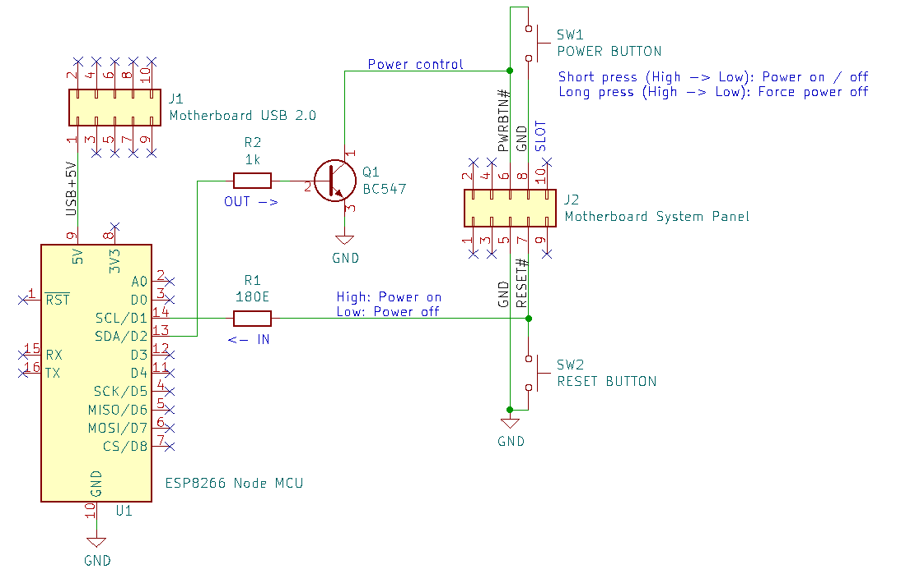

RemoteTrigger
=============

A tiny webserver for the XIAO ESP32S3 to trigger the power button and read the current power state of regular ATX computers.
It's supposed to be connected via USB headers on the mainboard or USB port of the same machine. At least grounding must match.

# Setup

D0 triggers the transistor. Between D0 and the BC547 transistor should be a 1k Ohm resistor to secure the isolation between the ESP32 and the mainboard.
D1 reads the power status via the Reset pin. Between the ESP32 and the reset pin should be a 180 Ohm resistor to minimize current when the ESP32 pin is accidently set to output.

# Usage

Copy the config.default.h to config.h and change the WiFi credentials.
Uncomment and change the IP address settings accordingly, if DHCP is not an option.

## Endpoints

* GET /status either returns 0 or 1
* POST /power triggers for 1 second
* POST /hold triggers for 5 seconds (hard power off)

# Credits

This solutions is heavily inspired by the [ESPHomePCPowerControlHomeAssistant](https://github.com/Erriez/ESPHomePCPowerControlHomeAssistant/) project.
The copyright of the schematic drawing blongs there as well.

